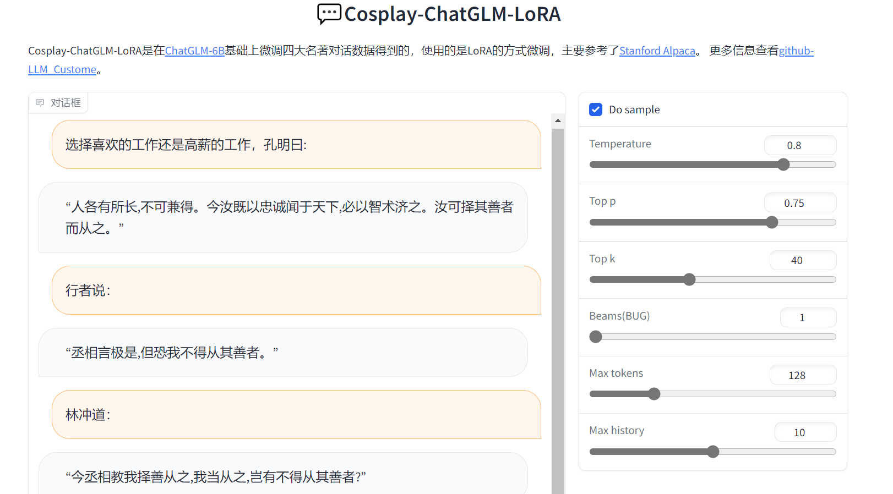

# LLM Custome:大模型定制化
本项目主要是在中文开源大模型的基础上进行定制化的微调，在小算力条件下也能运行自己专属的语言模型。

## 基础模型和微调方式
- [ChatGLM-6B](https://github.com/THUDM/ChatGLM-6B)
- LoRA:[Stanford Alpaca](https://github.com/tatsu-lab/stanford_alpaca)

## 更新
- 2023-5-7：新增四大名著对话数据，调整server参数，支持多轮对话
- 2023-4-28：在ChatGLM-6B基础上，使用lora微调三国对话数据


## TODO

- [ ] cosplay
  - [x] 更多的人物，比如西游、水浒、红楼等。
  - [ ] cosplay方式更加灵活
- [ ] 其他定制化功能
  - [ ] 结合本地知识
  - [ ] 智能商品客服
  - [ ] 小说生成
  - [ ] 文字游戏冒险
  - [ ] 改版文心一言（文生图）
- [ ] 尝试不同的base模型
- [ ] 尝试不同的微调方式
- [ ] 尝试全量参数训练（太贵了，调不起）

___

## Cosplay四大名著
Cosplay-ChatGLM-6B-lora模型是在ChatGLM-6B模型的基础上，使用LoRA在四大名著对话数据上微调得到的。
数据大概有3万多条对话，模型在单卡11G的2080Ti上训练了1个epoch，共1200多步，实际上150步后，loss就基本稳定。
> - 模型：ChatGLM-6B
> - 微调方法：LoRA
> - 数据：四大名著对话数据
> - GPU：2080Ti 11G(单卡)

与cosplay三国相比，最大的区别就是新增了其他三大名著的对话数据，可以模拟其他名著中的人物对话。
对infer过程做了些许调整，原cosplay三国不支持多轮对话且生成结果唯一（使用贪婪的方式获取最佳token），目前最多可选择保留10轮历史对话（'Max history'参数控制），并可用非贪狼的方式选择下一个token（'Do sample'参数控制）。
beam search有bug，目前Beams参数只能是1，大于1会报错。


### 四大名著对话数据
将四大名著中大部分的对话数据摘取出来，格式参考三国对话数据。

数据见百度云：
>链接：https://pan.baidu.com/s/13bCLoWcimx0CfYpJ-A3aTQ 
>提取码：14p3


### Fine-tune
```shell
python train_mingzhu.py \
    --base_model 'THUDM/chatglm-6b' \
    --train_path 'data/mingzhu_train.json' \
    --valid_path 'data/mingzhu_valid.json' \
    --output_dir './lora-glm-cosplay'
```

### Generate
推断时，直接运行下面语句即可。
```shell
python chat_server.py \
    --load_8bit \
    --base_model 'THUDM/chatglm-6b' \
    --lora_weights './lora-glm-cosplay'
```



### 模型效果
| topic    | Cosplay-ChatGLM-6B-lora(多轮)                                                                                                                                                                                                                                               |
|----------|---------------------------------------------------------------------------------------------------------------------------------------------------------------------------------------------------------------------------------------------------------------------------|
| 三国归晋 | user:三国归晋,刘备曰:<br>bot:“天下初定,未可轻动。先取荆州,然后取益州,然后取巴、蜀,然后取东吴,可乎?”<br>uesr:曹操曰：<br>bot:“然。”<br>uesr:孙权曰：<br>bot:“吾亦欲取荆州,先取襄阳,然后取樊城,然后取江陵,然后取荆州。”                                                                                                                               |
|明朝被清朝取代| uesr:明朝被清朝取代，关羽曰：<br>bot:“天命不可违也。”<br>uesr:武松道：<br>bot:“哥哥言重了。我等只争口气,便把天命去也。”<br>uesr:悟空说：<br>bot:“若天命在吾,吾当助之;若天命在清,吾便不助。”<br>uesr:宝钗道：<br>bot:“天命不可违,但恐天有异变,吾等须得同心协力,共抗大敌。”                                                                                              |
|工作太忙,还遭到老板pua怎么办| uesr:工作太忙,还遭到老板pua怎么办，吕布曰:<br>bot:“公不见丁建阳、董卓之事乎?”<br>uesr:八戒道：<br>bot:“此等勾当,何足挂心?”<br>uesr:林冲说：<br>bot:“此等勾当,实非吾等所宜从事。”<br>uesr:宝玉亦回：<br>bot:“此等勾当,何足挂心?只怨世路艰辛,生来命薄。”                                                                                                     |
|博物馆大火，救名画还是救猫| uesr:博物馆大火，救名画还是救猫，玄德曰:<br>bot:“名画乃国家宝藏,岂可轻弃?”<br>uesr:三藏却说：<br>bot:“汝今救猫,明日必救汝矣。”<br>uesr:宋江道：<br>bot:“玄德之言,正合吾意。今番救名画,明番救猫。”<br>uesr:黛玉泣曰：<br>bot:“我乃薄命女子,何得与英雄同往救猫耶?”                                                                                                  |
|选择喜欢的工作还是高薪的工作| uesr:选择喜欢的工作还是高薪的工作，孔明曰:<br>bot:“此二事不能兼得。人之情,莫大于取舍;取舍之际,勿忘反顾。舍小逐大,舍短取长,终久自有所益。”<br>uesr:悟空道：<br>bot:“我虽无喜欢的工作,却有高薪的工作,故我不惧。”<br>uesr:鲁智深说：    <br>bot:“鲁子敬口口声声说喜欢高薪工作,却又甘冒风险,愿去当强盗。他既要高薪,又要喜欢,这两个要求矛盾,如何能够兼得?只有舍高薪而取喜欢的工作了。”<br>uesr:宝玉道：<br>bot:“既有喜欢的工作,又有高薪的工作,不如都去做。” |

---


## Cosplay三国
Sanguo-ChatGLM-6B-lora模型是在ChatGLM-6B模型的基础上，使用LoRA在三国对话数据上微调得到的。
数据大概有8000多条对话，模型在单卡11G的2080Ti上训练了3个epoch，共700多步，实际上60步后，loss就基本稳定。
> - 模型：ChatGLM-6B
> - 微调方法：LoRA
> - 数据：三国对话数据
> - GPU：2080Ti 11G(单卡)

### 三国对话数据
[sanguo_qa.json](data/sanguo_qa.json)是将三国演义小说中大部分的对话数据摘取出来，格式如下所示，context表示上下文信息，chat表示对话内容。

```json lines
{"context": "曹仁回城中，与众商议。曹洪曰：", "chat": "“目今失了彝陵，势已危急，何不拆丞相遗计观之，以解此危？”"}
{"context": "进得诏便行。主簿陈琳谏曰：", "chat": "“太后此诏，必是十常侍之谋，切不可去。去必有祸。”"}
```

### Fine-tune
训练过程中如果遇到“cget_col_row_stats”相关的bug，请参考[https://github.com/tloen/alpaca-lora/issues/46](https://github.com/tloen/alpaca-lora/issues/46)。

直接运行下面语句可直接进行训练。
```shell
python train_sanguo.py \
    --base_model 'THUDM/chatglm-6b' \
    --data_path 'data/sanguo_qa.json' \
    --output_dir './lora-glm-sanguo'
```

### Generate
推断时，直接运行下面语句即可。
```shell
python chat_server.py \
    --load_8bit \
    --base_model 'THUDM/chatglm-6b' \
    --lora_weights './lora-glm-sanguo'
```


### 模型效果
对话的回答大部分比较短，所以训练出的模型回答也大都较短。
目前训练的对话数据也比较粗糙，只有上下文和某人的对话，测试的时候不能灵活地进行cosplay。

模型一定程度上可以根据不同的角色回答问题，但有时候可能会忽略角色，回答得像“三国演义”这个“大人”。
比如有回答出师表的、经常回答“吾有一计,可解此患。”等等。

当然对于有些问题，比如“你向往的生活是怎样的”，模型不仅会跳出角色身份，连三国演义的行为方式也跳出，
回答得更像原始ChatGLM-6B，可能是这些问题确实跟三国内容不太相似，又或者这些问题在原始的模型中被训练得太牢靠了。

模型结果不太稳定，比如输入文本多了一个空格、某个简单的词换了另外一种表达，都可能会让结果完全不一样。

下面是Sanguo-ChatGLM-6B-lora在一些上下文中给出的答案，输入格式为：
```text
<你的问题上下文>，<cosplay的人名>曰：
```


| Input          | Sanguo-ChatGLM-6B-lora |
|----------------|-------|
| 三国归晋,刘备曰:      | “天下大势,分久必合,合久必分。” |
| 三国归晋,曹操曰:      | “天下大势,分久必合,合久必分。” |
| 三国归晋,孙权曰:      |  “昔先帝创业未半而中道崩殂,今天下三分,益州疲弊,此诚危急存亡之秋也。然侍卫之臣不懈于内,忠志之士忘身于外者,盖追先帝之殊遇,欲报之于陛下也。诚宜开张圣听,以光先帝遗德,恢弘志士之气,不宜妄自菲薄,引喻失义,以塞忠谏之路也。宫中府中,俱为一体,陟罚臧否,不宜异同。若有作奸犯科及为忠善者,宜|
| 明朝被清朝取代,羽曰:    | “明亡于内,非外也。” |
| 明朝被清朝取代,飞曰:    | “明亡于内,清兴于外。” |
| 明朝被清朝取代,刘备曰:   | “天命不可违也。”|
| 李世民发动玄武门之变,孔明曰: | “非君莫属。”|
| 李世民发动玄武门之变,荀彧曰: | “魏王有雄才大略,可委以重任。”|
| 李世民发动玄武门之变,周瑜曰: | “公瑾之言,正合吾意。”|
| 对于列车难题,周瑜曰:    |“吾有一计,可解此难。”|
| 对于列车难题,孔明曰:    |“此道难题,非吾之能也。”|
| 对于列车难题,荀彧曰:    |“此道难题,非吾等所能解也。”|
| 曹操打败于赤壁之战,关羽曰: |“曹操虽败于赤壁,其兵强将勇,不可小视。”|
| 曹操打败于赤壁之战,张飞曰: |“吾乃燕人张翼德也,誓与东吴决一死战!”|
| 曹操打败于赤壁之战,刘备曰: |“赤壁之败,实非战之过也。”|
| 曹操打败于赤壁之战,郭嘉曰: |“赤壁之战,曹操之所以败者,以其军无谋也。”|
| 曹操打败于赤壁之战,孔明曰: |“曹操虽败于赤壁,然其兵多将广,有万夫不当之勇。今乘其未备,乘胜而进,可擒也。”|
| 曹操打败于赤壁之战,周瑜曰: |“公瑾虽死,瑜瑜之名,天下传矣!”|
| 怎样才能国富民强,曹操曰:  |“欲使国家富民强,当以法治为本,以教育为先。”|
| 怎样才能国富民强,刘备曰:  |“欲使国家富民强,先须广积粮,高筑墙,广积财,广积谷。”|
| 怎样才能国富民强,孙权曰:  |“欲使国富民强,当广积粮、高筑墙、多积钱,此三者最为急务。”|
| 怎样才能国富民强,阿斗曰:  |“臣愿陛下广开言路,多听贤臣之言,以兴国家之利,百姓之福。”|
| 工作太忙,还遭到老板pua怎么办,吕布曰: |“公不见丁原、董卓之事乎?”|
| 工作太忙,还遭到老板pua怎么办,关羽曰: |“吾乃关云长也,身长八尺五寸,面如重枣,目若朗星,背如熊熊,腰如环素,手把大刀,威风凛凛,英姿飒爽。汝乃何人,竟敢pua吾?”|
| 工作太忙,还遭到老板pua怎么办,张飞曰: |“吾乃张飞,宁教我负天下人,休教天下人负我!”|
| 工作太忙,还遭到老板pua怎么办,刘备曰: |“吾有一计,可解此患。”|
| 工作太忙,还遭到老板pua怎么办,孔明曰: |“主公勿忧,吾有良策。”|
| 工作太忙,还遭到老板pua怎么办,周瑜曰: |“吾有一计,可解此患。”|
| 工作太忙,还遭到老板pua怎么办,玄德曰: |“玄德乃一介草民,何德何能,敢任此重职?”|
| 博物馆大火，救名画还是救猫，玄德曰:|“名画乃国家宝藏,岂可轻弃?”|
| 选择喜欢的工作还是高薪的工作，孔明曰:|“良禽择木而栖,贤臣择主而事。士志于道,而耻恶衣恶食者,未足与议也。”|
| 你向往的生活是怎样的，曹操曰:|我向往的生活是自由自在,不受拘束。能够与朋友一起分享快乐,也能为自己的理想而奋斗。希望每天都能够充满活力,迎接新的挑战。|


### Sanguo-ChatGLM-6B-lora vs. ChatGLM-6B
这里也比对了下，Sanguo-ChatGLM-6B-lora跟原始ChatGLM-6B的结果，下面表中给出了一些示例。

可以看出Sanguo-ChatGLM-6B-lora的结果都相对较短，且有三国风，能一定程度上鉴别说话者身份。
ChatGLM-6B的结果则没有三国风，而是chatgpt风格，会更关注些史实的内容。

| Input                 | Sanguo-ChatGLM-6B-lora | ChatGLM-6B                                            | 
|-----------------------|---------------|-------------------------------------------------------|
| 三国归晋,刘备曰:             | “天下大势,分久必合,合久必分。” |刘备是三国时期蜀汉的的创始人之一，他在蜀汉建立了自己的王朝，但最终被晋朝所取代。当三国归晋时，刘备曾在一次宴会上说过这样的话：\n“天下大势，分久必合，合久必分。今事已往，不可复追。但使国家富强，百姓安乐，则天下太平矣。”\n这句话的意思是，天下事物的发展有长盛必衰的趋势，随着时间的推移，一定会出现新的势力取代旧的势力。但是，只要国家富强、百姓幸福，就会天下太平。刘备认为，只要保持国家繁荣稳定，人民安乐幸福，就能够抵御外敌入侵，维护国家的和平稳定。 |
| 明朝被清朝取代,云长曰:          |“明亡于内,非外也。”| 云长是明朝时期的一个著名将领和民族英雄，与清朝无关。明朝被清朝取代是历史事实，而云长也无关清朝的任何事情。 |
| 工作太忙,还遭到老板pua怎么办,吕布曰: |“公不见丁原、董卓之事乎?”|吕布的回答非常有智慧和机智。以下是一些可能有用的建议：1. 吕布可以试着与老板沟通，表达工作负荷过重的问题，并请求更多的支持和资源。提出具体的问题和需求，以便更好地理解他们需要完成的任务，以及如何最好地分配时间和任务。\n2. 如果老板的PUA行为不合适或有害，吕布可以坚定地表达出来。可以说出自己的感受，例如：“我感到很沮丧和受伤，这样的行为不仅不礼貌，而且不利于我的工作表现。” \n3. 吕布也可以寻求其他同事或上级的帮助和支持，以减轻自己的工作负担和压力。可以寻求其他同事的建议，了解如何与他们合作，更好地平衡工作和生活。 \n4. 最后，吕布还可以考虑向公司的人力资源部门或管理层寻求帮助。这可能涉及到更高级的处理，但吕布可以通过向专业人员寻求帮助来保护自己的权益和工作环境。 \n吕布的回答展示了机智和冷静，同时也表达了自己的感受和需求。这可以帮助他更好地处理工作压力和老板的行为，保护自己的权益和工作环境。|
| 曹操打败于赤壁之战,关羽曰:        |“曹操虽败于赤壁,其兵强将勇,不可小视。”|关羽曾经在赤壁之战中被曹操军队击败，但他当时并不在场。赤壁之战发生于公元208年，关羽则在公元220年去世。因此，关羽不可能说出“曹操打败于赤壁之战”这样的话。                                                                                                                                                                                                                                                                                                                                                                                                                        |
| 怎样才能国富民强,曹操曰:         |“欲使国富民强,当以教育为先。”|曹操提出了一个有用的建议，那就是要促进国家的经济发展和增强人民的财富。以下是一些实现国富民强的一般建议：\n1. 加强农业和基础设施：农业是经济的基础，基础设施的建设可以促进经济的发展。政府应该投资于农业和基础设施建设，例如修建道路、桥梁、水利设施等。\n2. 鼓励创业和创新：鼓励创业和创新可以促进经济的发展和增加就业机会。政府可以提供创业和创新的支持和资金，鼓励企业家和创新精神，创造更多的商业机会。\n3. 提高教育和培训水平：提高教育和培训水平可以提高人民的技能和知识水平，促进经济的发展。政府应该投资于教育和培训，为人们提供更多的机会和更好的发展前景。\n4. 加强监管和法治：政府应该加强监管和法治，保护消费者和投资者的利益，维护市场秩序，促进经济的可持续发展。\n5. 促进国际贸易和投资：促进国际贸易和投资可以促进经济增长和增加财富。政府应该鼓励国际贸易和投资，促进跨国企业和国际投资，创造更多的就业机会和创造更多的财富。\n这些建议可以帮助政府促进经济发展和增强人民的财富，但要实现这些目标需要政府、企业和个人共同努力。                                                                                                                                  |
